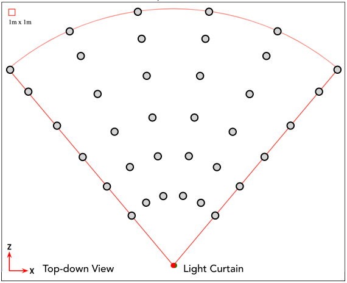
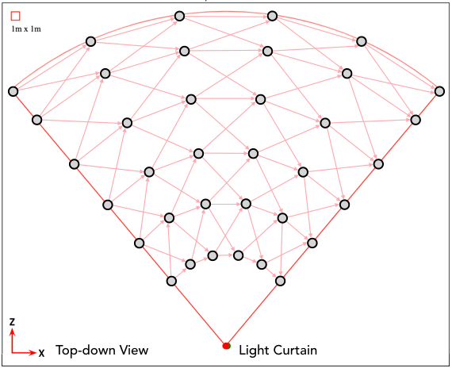

# Light Curtain Constraint Graph
**A planning and optimization library for light curtains using the constraint graph.**<br>
<span style="color:blue;"><i>Efficient C++ implementation, with APIs for Python and Javascript!</i></span>


| **Constraint Graph** | **Dynamic Programming** |
|:---:|:---:|
 | 


## Installation

**1. Clone repository**
- Run the following commands:
    ```bash
    git clone --recursive https://github.com/CMU-Light-Curtains/ConstraintGraph.git
    cd ConstraintGraph
    ```

**2. Make sure that `MAX_RAYS` and `MAX_RANGES_PER_RAY` are set to reasonable values**
- Set them in `include/planner/base.h`.
- For correctness, they should always be greater than or equal to the true number of rays and ranges per ray.
- For efficiency, they should be as small as possible, ideally equal to the true rays and ranges per ray.

**3. Build with python bindings**
- Run the following commands:
    ```bash
    rm -rf build && mkdir build && cd build
    cmake -DCMAKE_BUILD_TYPE=Release \
          -DBIND_PY=ON \
          -DPYTHON_EXECUTABLE=<<PATH-TO-PYTHON-EXECUTABLE>> ..
    make -j
    cd ..
    ```
- To test the python build, run the following commands. The output should match `apis/py/output.txt`.
    ```bash
    cd apis/py
    python lc_planner/planner.py
    ```
**4. Build with javascript bindings**
- Download and install [emscripten](https://emscripten.org/index.html): [\[Click here for download and install instructions\]](https://emscripten.org/docs/getting_started/downloads.html)
- After installation, relaunch your shell, and make sure that the `$EMSDK` environment variable has been set to point to the directory where emscripten has been installed. Also make sure that the following file exists:
```$EMSDK/upstream/emscripten/cmake/Modules/Platform/Emscripten.cmake```
- Run the following commands:
    ```bash
    rm -rf build && mkdir build && cd build
    cmake -DCMAKE_BUILD_TYPE=Release \
          -DBIND_JS=ON ..
    make -j
    cd ..
    ```
- To test the javascript build, run the random curtain demo.
    - Launch the demo's HTTP server using the following command:
        ```bash
        python -m http.server -d apis/js/random-curtain-demo
        ```
    - Run the URL `http://127.0.0.1:8000/` in your browser.

